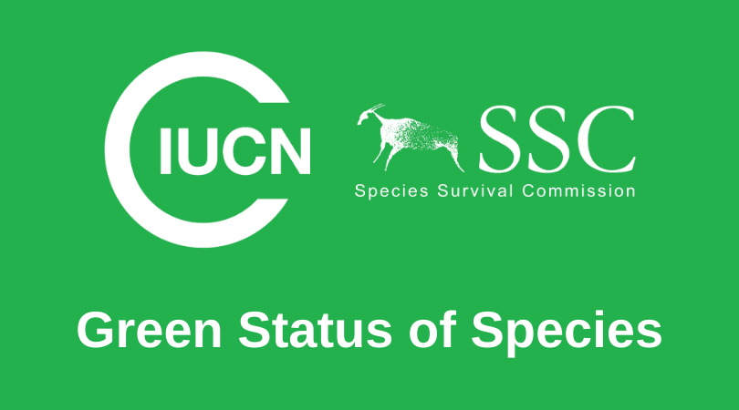



---

### Assessment of Potential Recovery based on IUCN Green Status for endangered flora species of Brazilian Cerrado 

As a part of this new effort of IUCN to assess the impact of species conservation interventions, this is a pilot project to test and improve the Green Status Protocol. It will be performed for 10 Brazillian Cerrado species under National Center for Flora Conservation ([CNCFlora](http://cncflora.jbrj.gov.br/portal)) leading and funding by The Critical Ecosystem Partnership Fund ([CEPF](https://www.cepf.net/)). 

