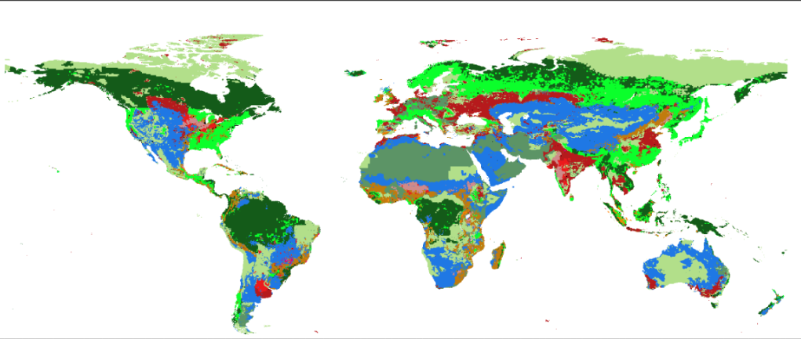



## LUH2 and LULC data

---

### The project

Land-use land-cover (LULC) data are important predictors of species occurrence and biodiversity threat. Although there are LULC datasets available under current conditions, there is a lack of such data under historical and future climatic conditions. This hinders, for example, projecting niche and distribution models under global change scenarios at different time scenarios. The [Land Use Harmonization Project (LUH2)](https://luh.umd.edu/) is a global terrestrial dataset at 0.25° spatial resolution that provides LULC data from 850 to 2300 for 12 LULC state classes. The dataset, however, is compressed in a file format (NetCDF) that is incompatible for many analyses and requires layer extractions and transformations that are intractable for most researchers. Here we selected and transformed the LUH2 in a standard GIS format data to make it more user-friendly. We provide LULC for every year from 850 to 2100, and from 2015 on, the LULC dataset is provided under two Shared Socioeconomic Pathways (SSP2-4.5 and SSP5-8.5). We provide two types of files for each year: separate files with continuous values for each of the 12 LULC state classes, and a single categorical file with all state classes combined. To create the categorical layer, we assigned the state with the highest value in a given pixel among the 12 continuous data. LUH2 predicts a pronounced decrease in primary forest, particularly noticeable in the Amazon, the Brazilian Atlantic Forest, the Congo Basin and the boreal forests, an equally pronounced increase in secondary forest and non-forest lands, and in croplands in the Brazilian Atlantic Forest and sub-Saharan Africa. The final dataset provides LULC data for 1251 years that will be of interest for macroecology, ecological niche modeling, global change analysis, and other applications in ecology and conservation.
